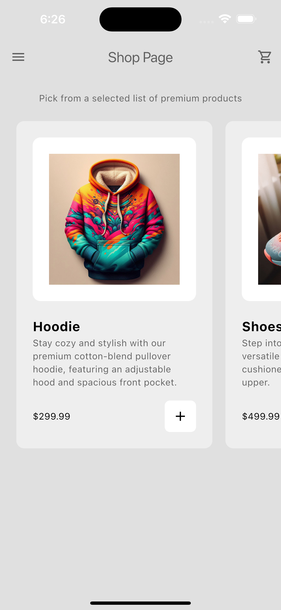

# Flutter E-Commerce App

A modern and minimalistic e-commerce app built with Flutter. This app features a clean design, a dark mode and light mode toggle, a home page showcasing products with an "add to cart" feature, and a cart page with a delete function.

## Features

- **Home Page**: Browse a selection of products with detailed information and an "add to cart" feature.
- **Cart Page**: View selected products in the cart with the ability to remove items.
- **App Drawer**: Access additional app features and settings easily through the side drawer menu.
- **Dark Mode & Light Mode**: Toggle between dark and light themes to suit your preferences.
- **Clean & Modern Design**: A user-friendly interface with a focus on simplicity and aesthetics.

### Download Links

- **Android APK**: [Download APK](https://github.com/SubhajitDolai/Ecommerce-app/releases/tag/v1.0.0-beta)

## Screenshots

### Dark Mode

  
  
  
  
  

### Light Mode

  
  
  
  
  

## Dependencies

- [Flutter](https://flutter.dev/) - A framework for building natively compiled applications for mobile, web, and desktop from a single codebase.
- [Provider](https://pub.dev/packages/provider) - A wrapper around InheritedWidget to manage state.
- [switcher_button](https://pub.dev/packages/switcher_button) - A customizable toggle switch button for Flutter, used for dark mode and light mode switching.

## How It Works

The app is designed to provide a seamless shopping experience with a focus on usability. The home page displays a list of products, which users can browse and add to their cart. The cart page allows users to review their selections and remove items if needed. The app supports both dark mode and light mode, providing a comfortable user experience in any lighting condition. State management is handled using the `Provider` package, ensuring a smooth and responsive interface.

## Contributing

Contributions are welcome! Feel free to submit a pull request or open an issue if you have suggestions for improvements or new features.

## Contact

If you have any questions or feedback, feel free to reach out:

- **Email**: subhajitdolai999@gmail.com
- **GitHub**: [SubhajitDolai](https://github.com/SubhajitDolai)